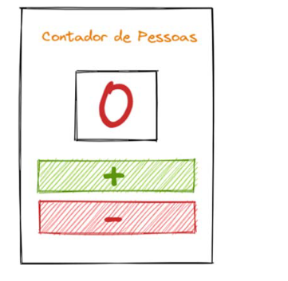

# TP - Programação Orientada a Objetos
## Criar um App "contador de pessoas" com react seguindo o esboço.
### Esboço

### Resultado


## Criar um App "Multiplicador" com react seguindo o esboço.
### Esboço

### Resultado


## Pré Requisitos
- NodeJS
- NPM
- ReactJS

## Como rodar o projeto
1 - Clone este repositório
```shell
git clone https://github.com/Cawe541/Web-NodeJS-ReactJS-
```

2 - Clone este repositório Entre na pasta de um dos projetos e rode o comando no terminal:
```shell
npm install
```

3 - Clone este repositório Entre na pasta de um dos projetos e rode o comando no terminal:
```shell
npm start
```
